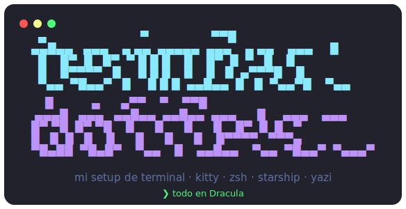

<div align="center">




</div>

> Hola 👋 Soy **prgr1no**. Esto es el setup de terminal que uso a diario en mis máquinas Linux:
> rápido, con estilo [Dracula](https://draculatheme.com) de arriba a abajo y sin frameworks pesados.
> Lo guardo aquí para reinstalarlo en **un solo comando** cuando estreno equipo — y por si a alguien más le sirve. Si te mola, deja una ⭐.

<div align="center">
  
</div>

## ⚡ Instalación rápida (un solo curl)

```bash
curl -fsSL https://raw.githubusercontent.com/prgr1no/terminal-dotfiles/main/bootstrap.sh | bash
```

Instala las herramientas (kitty, zsh, Starship, yazi, fzf, fd, ripgrep, bat, eza, zoxide + Hack Nerd Font) en **Ubuntu/Debian (apt)** o **Fedora (dnf)** y copia las configuraciones. Es idempotente: puedes relanzarlo sin miedo. Pedirá `sudo` para los paquetes del sistema.

> Sano ser precavido con cualquier `curl | bash` — mira antes qué hace:
> ```bash
> curl -fsSLO https://raw.githubusercontent.com/prgr1no/terminal-dotfiles/main/bootstrap.sh
> less bootstrap.sh && bash bootstrap.sh
> ```

## ✨ Qué hay dentro

- **kitty** — emulador GPU con transparencia (+ blur en KDE/Wayland), tema Dracula, Nerd Font y ~47 atajos.
- **zsh** — sin Oh My Zsh: autosugerencias, resaltado de sintaxis, historial compartido.
- **Starship** — prompt Dracula con usuario, host, ruta, rama Git y código de error.
- **yazi** — explorador de archivos con **vista previa de imágenes** en la propia terminal.
- **bat · eza · fzf · fd · ripgrep · zoxide · duf · ncdu** — las utilidades modernas de siempre.
- **Paleta Dracula compartida** para bat, fzf, ripgrep, eza/ls, less, Starship y btop.

## 📄 Atajos

Me hice una chuleta para no acordarme de memoria: **[docs/cheatsheet.md](docs/cheatsheet.md)** (kitty, zsh y yazi).

## 📁 Estructura

```text
dotfiles/          bashrc · zshrc
config/            kitty · yazi · starship · terminal-kit · ripgrep · btop
docs/              terminal-kit.md · cheatsheet.md · banner.svg · preview.svg
bin/               install.sh
bootstrap.sh       instalador de un curl
```

## 🚀 Instalación manual

Si ya tienes las herramientas y solo quieres las configuraciones:

```bash
git clone https://github.com/prgr1no/terminal-dotfiles ~/terminal-dotfiles
cd ~/terminal-dotfiles
bash bin/install.sh      # hace backup de lo existente antes de reemplazar
```

Abre una terminal nueva (o kitty) y listo.

## 🔧 Requisitos

| Herramienta | Para qué | Fuente |
|---|---|---|
| **kitty** | emulador de terminal | `dnf/apt install kitty` o el [instalador oficial](https://sw.kovidgoyal.net/kitty/binary/) |
| **zsh · starship · fzf · fd · ripgrep · bat · eza · zoxide** | shell y utilidades | gestor de paquetes o binarios de usuario |
| **yazi** | explorador con vista de imágenes | [sxyazi/yazi](https://github.com/sxyazi/yazi) |
| **Una Nerd Font** | iconos de eza/starship | [Nerd Fonts](https://www.nerdfonts.com/) (yo uso Hack) |

> El `bootstrap.sh` se encarga de todo esto por ti en apt/dnf.

## 🎨 Tema

**Dracula** en todo: kitty, prompt, yazi, `LS_COLORS`, fzf, bat, ripgrep y btop.

`#282a36` fondo · `#f8f8f2` texto · `#bd93f9` morado · `#50fa7b` verde · `#8be9fd` cian · `#ff79c6` rosa

## 🆘 Volver a bash

¿Un día no quieres el salto automático a zsh?

```bash
TERMINAL_KIT_DISABLE_ZSH=1 bash
```

## 📜 Licencia

[MIT](LICENSE) — cógelo, tócalo, hazlo tuyo.

<div align="center">
<sub>Hecho con ☕, Dracula y demasiado rato pixelando el banner.</sub>
</div>
